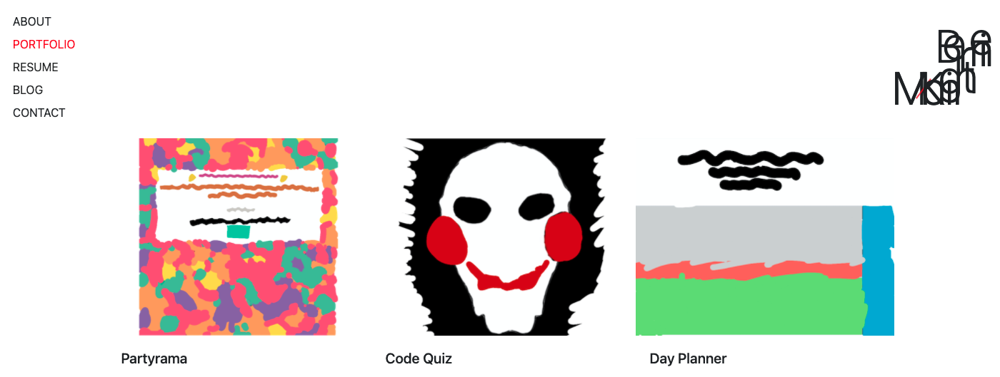

# has-anybody-seen-the-butter

[LiveDemo](https://sissyhanks.github.io/has-anybody-seen-the-butter/)

## Description

This site is a personal portfolio built to showcase web development projects and is intended to evolve as a long term project where new skills can be honed and features executed.

- What was your motivation?
- Why did you build this project? (Note: the answer is not "Because it was a homework assignment.")
- What problem does it solve?
- What did you learn?

## Credits

This website was built using [Bootstrap](https://getbootstrap.com/)
Thank you to Mena McKnight for providing the illustrations for this site

## Features

Keyframe animation is used to give the illusion that a line is being drawn, as well as to bounce an SVG element around the header
